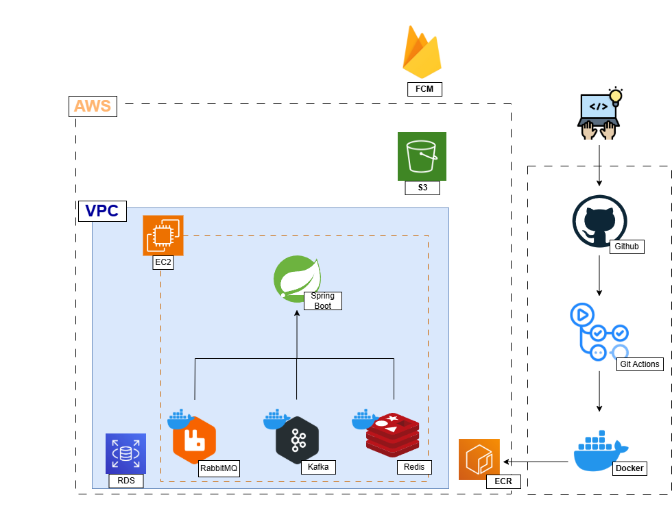
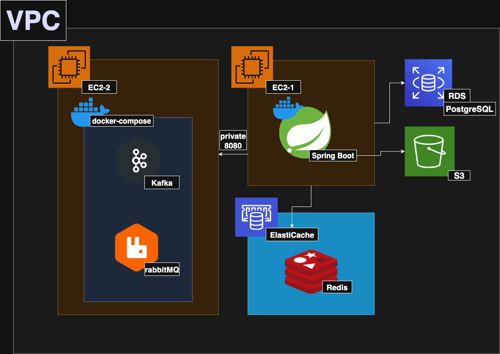

# 🚒 삐뽀삐4 (B4B4)

> **재난의 골든타임을 지킨다, 모두가 함께.**  
> 개인(IND) · 공공기관(GOV) · 민간단체(NGO)를 하나로 연결하는 **실시간 재난 긴급 지원 플랫폼**


## 📖 서비스 소개

**“삐뽀삐4”** 는 재난 발생 직후부터 복구·지원까지 모든 단계를 아우르는 통합 플랫폼입니다.  
한 개인의 신고가 공공기관과 민간단체를 움직이고, 봉사자들은 안전하게 조직되어 현장으로 향합니다.

👉 **우리의 목표**는 기술로 사람을 연결하고 생명을 구하는 것입니다.


## ✨ 주요 기능

### 🔐 인증 / 인가
- JWT 기반 로그인 / 회원가입
- AccessToken + RefreshToken 구조
- Redis 기반 RefreshToken 저장 및 재발급
- Role 기반 접근 제어 (IND, GOV, NGO)


### 📍 위치
- 사용자 주변 nkm 반경 내 재난 히트맵 표시
- 사용자 근처 대피소 정보 제공 (카카오 맵 연동)


### 🚨 신고
- 재난 신고 등록 기능
- Kafka 기반 실시간 알림 → 공공기관 전달
- 신고 상태 관리 (PENDING → RECEIVED → CLOSED)
- 신고 목록 및 상세 조회
- Kafka DLQ 기반 실패/예외 처리


### ❤️ 봉사
- 민간단체: 봉사 모집글 생성 / 수정 / 조회
- 개인: 모집글 참가 / 취소
- Redis Lua Script 기반 실시간 팀 인원 관리 (INCR/DECR)
- 중복 및 정원 초과 방지
- Kafka + DLQ 기반 재처리


### 🔔 알림
- FCM 디바이스 토큰 등록
- 재난 신고 실시간 알림 (관할 공공기관 → 푸시 전송)
- 동일 유형 신고 다수 발생 시 전국 단위 알림 전송
- 봉사 모집글 수정 시 신청자 대상 알림
- 사용자별 수신 알림 조회 (최대 30건)


##  기술 스택

**Backend**


**Security**


**DB & ORM**


**Message Broker**


**Real-Time**


**Infra**


**Collaboration**


## 📌 아키텍처

### Cloud Architecture
V1  


V2  



## 📌 ERD


## 📌 와이어프레임
- Figma: https://embed.figma.com/board/CTz4eGFcktnV4imyqsNnT8/%EC%82%904%EC%82%904?node-id=0-1&t=kxXtaoKOu8ie5Ncs-1&embed-host=notion&footer=false&theme=system

## 📌 API 명세서

- Notion: https://www.notion.so/1f5859344fa4810f814ed30ee25a0fc9?v=1f5859344fa4814fbea8000c4ab5c5c2

## 📌 실행 방법

```bash
# 프로젝트 클론
git clone https://github.com/{username}/{repo}.git

# 환경 변수 설정
cp .env.example .env

# 빌드 및 실행
./gradlew build
java -jar build/libs/b4b4-0.0.1-SNAPSHOT.jar
